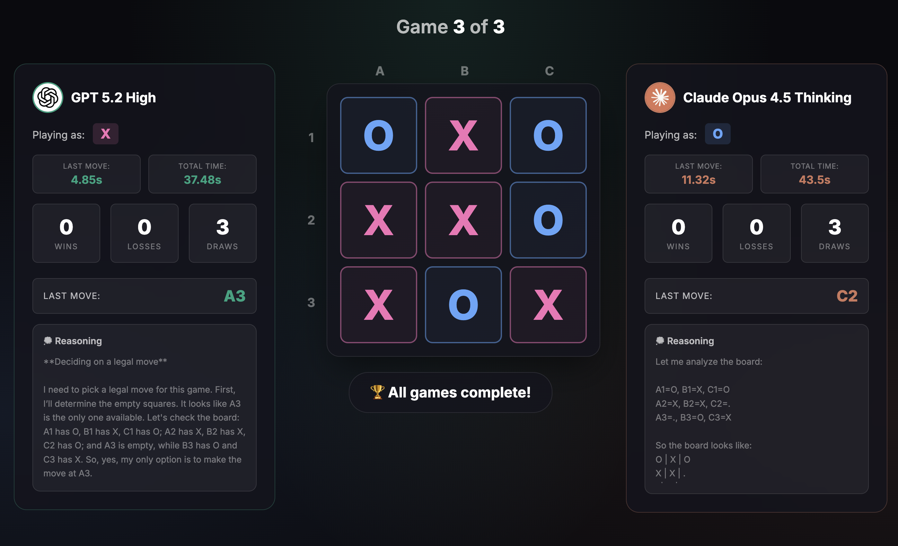

# Overview

This is a simple Tic Tac Toe game where GPT-4o plays against Claude Opus 4, both powered by OpenRouter API.



**IMPORTANT:** You need to have an OpenRouter API key to run this script.

# Quickstart
Create a .env file with the following variable:
```bash
OPENROUTER_API_KEY=your_openrouter_api_key
```

You can get your OpenRouter API key from: https://openrouter.ai/keys

Install dependencies:
```bash
python3 -m venv venv && source venv/bin/activate && pip install -r requirements.txt
```

Run the app:
```bash
python app.py
```

# Models Used
- **GPT Model**: openai/gpt-4o (via OpenRouter)
- **Claude Model**: anthropic/claude-opus-4 (via OpenRouter)

Both models are called through OpenRouter's unified API, which provides access to multiple AI models through a single interface.